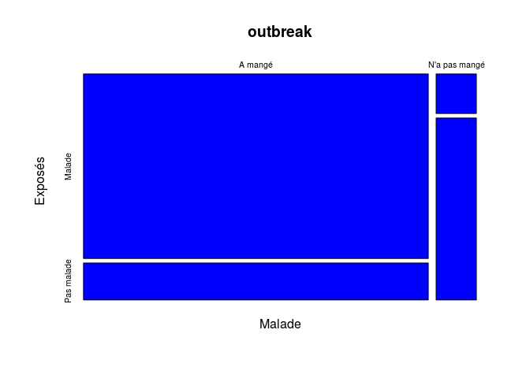
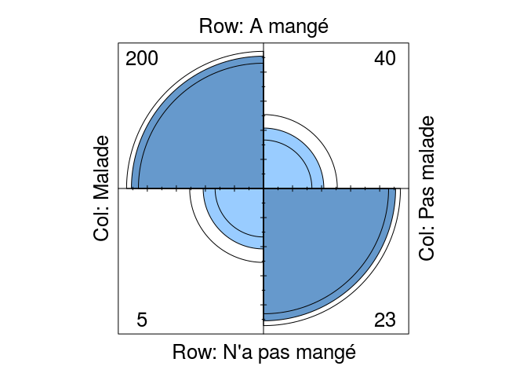

# Graphiques & Santé publique
JcB  
12/08/2014  

source: [Michael C. Samuel](http://www.medepi.net/docs/ph251d_2013fall_R-Visual-Display-Samuel.pdf)

Area chart
----------

Remplissage de l'aire dessinée par deux courbes.


```r
number <- 1000
a <- sort(rnorm(number))
b <- a^2
xx <- c(1:number, number:1)
yy <- c(a, rev(b))
plot(xx, yy, type="l")
polygon(xx, yy, col=2)
```

 

Table 2 x 2 (intox. alimentaire)
--------------------------------


```r
outbreak <- matrix(c(200, 40, 5, 23), byrow = TRUE, nrow = 2, dimnames = list(c("A mangé", "N'a pas mangé"), c("Malade", "Pas malade")))
View(outbreak)
chisq.test(outbreak, correct = FALSE)
```

```
## 
## 	Pearson's Chi-squared test
## 
## data:  outbreak
## X-squared = 59.78, df = 1, p-value = 1.059e-14
```

```r
library(Epi)
```

```
## 
## Attaching package: 'Epi'
## 
## The following object is masked from 'package:base':
## 
##     merge.data.frame
```

```r
twoby2(outbreak)
```

```
## 2 by 2 table analysis: 
## ------------------------------------------------------ 
## Outcome   : Malade 
## Comparing : A mangé vs. N'a pas mangé 
## 
##               Malade Pas malade    P(Malade) 95% conf. interval
## A mangé          200         40       0.8333    0.7807   0.8753
## N'a pas mangé      5         23       0.1786    0.0763   0.3638
## 
##                                     95% conf. interval
##              Relative Risk:  4.6667    2.1044   10.349
##          Sample Odds Ratio: 23.0000    8.2526   64.101
## Conditional MLE Odds Ratio: 22.5902    7.8063   80.595
##     Probability difference:  0.6548    0.4699    0.763
## 
##              Exact P-value: 0 
##         Asymptotic P-value: 0 
## ------------------------------------------------------
```

```r
mosaicplot(outbreak, col="blue", xlab="Malade", ylab="Exposés")
```

 

```r
assocplot(outbreak)
```

 

```r
fourfoldplot(outbreak)
```

 

